### Before optimization

#### Actions during profiling:

- Filtering data by region.
- Search for countries by name.
- Sort countries by population.

#### Parameters to Check:
- Commit Duration: 2.8s
- Render Duration: 6ms
- Interactions: Filtering data by region.
- Flame Graph: 

  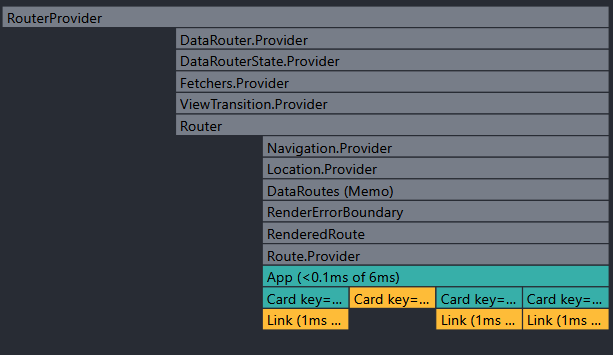
- Ranked Chart: 

  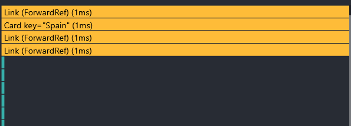

***
- Commit Duration: 7.1s
- Render Duration: 29ms
- Interactions: Search.
- Flame Graph: 

  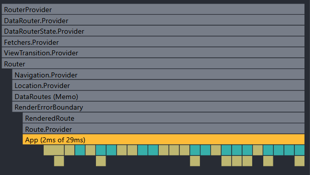
- Ranked Chart: 

  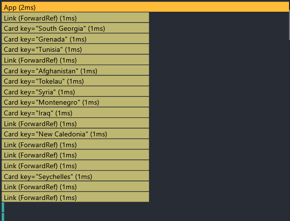

***
- Commit Duration: 3.3s
- Render Duration: 26ms
- Interactions: Sort.
- Flame Graph: 

  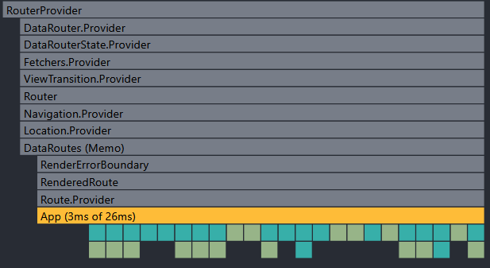
- Ranked Chart: 

  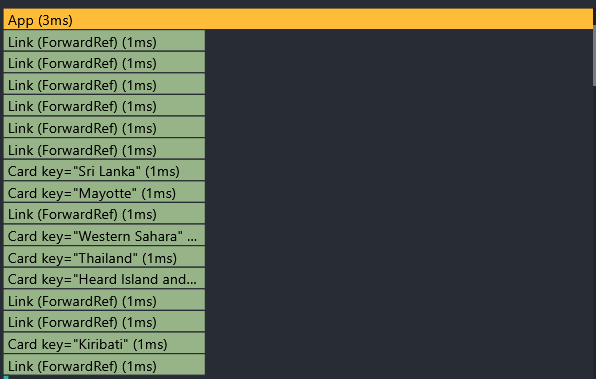

### After optimization

#### Actions during profiling:

- Filtering data by region.
- Search for countries by name.
- Sort countries by population.

#### Parameters to Check:
- Commit Duration: 2.6s
- Render Duration: 1ms
- Interactions: Filtering data by region.
- Flame Graph: 

  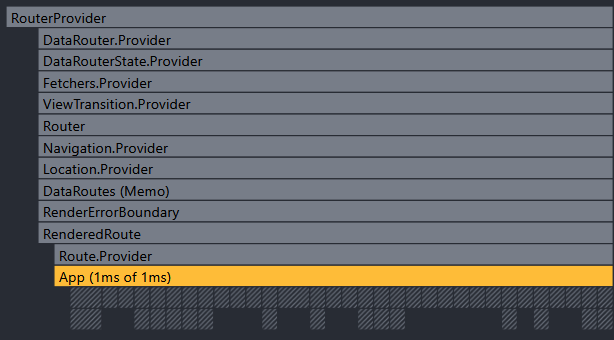
- Ranked Chart: 

  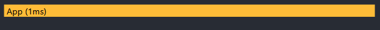

***
- Commit Duration: 1.8s
- Render Duration: <0.1ms
- Interactions: Search.
- Flame Graph: 

  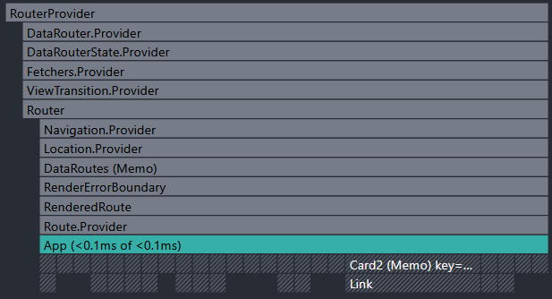
- Ranked Chart: 

  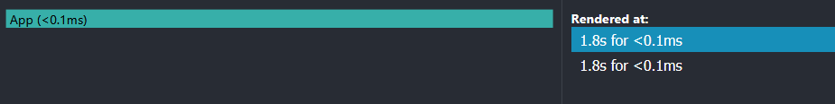

***
- Commit Duration: 3.1s
- Render Duration: 3ms
- Interactions: Sort.
- Flame Graph: 

  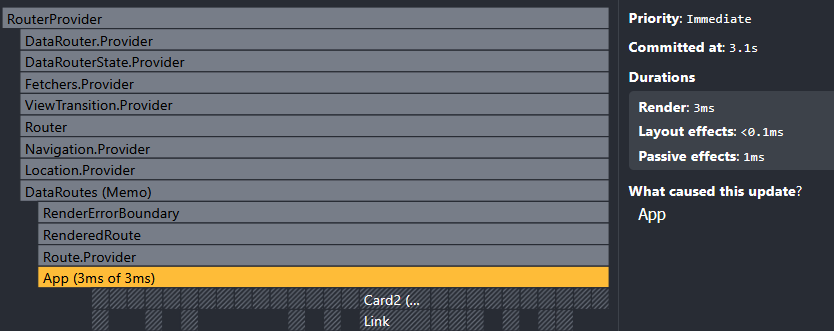
- Ranked Chart: 

  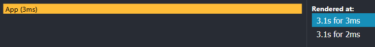
